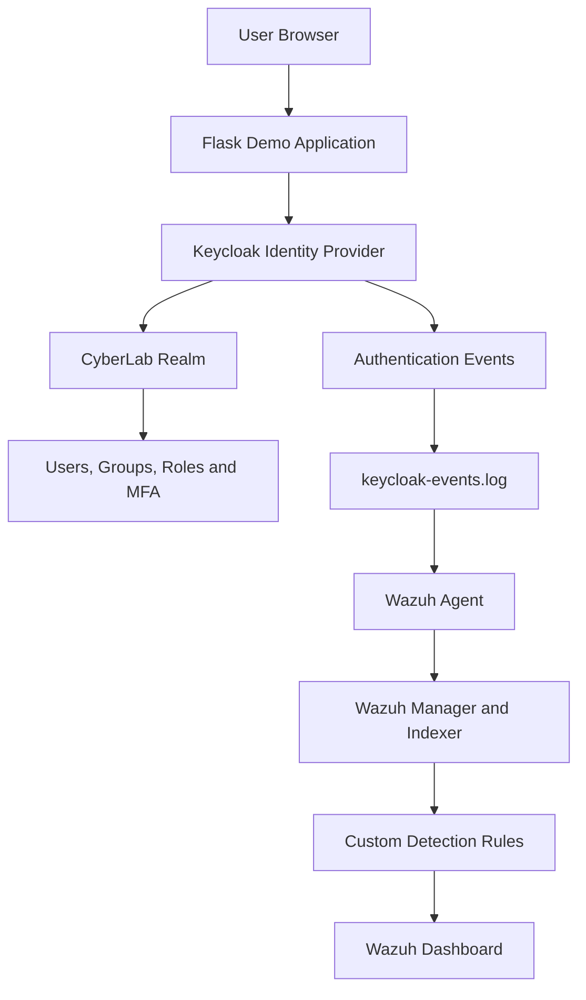

# Identity Attack and Defense Lab

## Overview

This project demonstrates an identity security environment built with Keycloak, a Flask application, and Wazuh.

The lab implements centralized authentication, multifactor authentication, role-based access control, brute-force protection, persistent identity-event collection, custom Wazuh detection rules, incident investigation, and recovery testing.

## Lab Objectives

- Deploy a centralized identity provider with Keycloak
- Configure users, groups, roles, and service identities
- Require MFA for privileged accounts
- Integrate a Flask application with OpenID Connect
- Enforce role-based access control
- Simulate repeated password-guessing attempts
- Detect authentication activity with Wazuh
- Temporarily lock accounts after repeated failures
- Investigate and recover an affected account
- Validate service persistence after reboot
- Collect evidence and document the results

## Environment

| Component | Address or Name |
|---|---|
| Ubuntu identity server | `192.168.56.121` |
| Wazuh server | `192.168.56.122` |
| Keycloak | `http://192.168.56.121:8080` |
| Flask demo application | `http://192.168.56.121:5000` |
| Wazuh Dashboard | `https://192.168.56.122` |
| Keycloak realm | `CyberLab` |
| Application client | `identity-demo-app` |

## Configuration

Create a local environment file before starting the services:

```powershell
Copy-Item .env.example .env
```

Replace the placeholder values inside `.env`:

```text
KEYCLOAK_ADMIN_PASSWORD=your-strong-admin-password
KEYCLOAK_CLIENT_SECRET=your-keycloak-client-secret
APP_SECRET=your-long-random-application-secret
```

The completed `.env` file is excluded from Git through `.gitignore` and must never be committed.

Start Keycloak with:

```powershell
docker compose up -d
```

The Flask application also requires `KEYCLOAK_CLIENT_SECRET` and `APP_SECRET` in its runtime environment.

## Architecture



A more detailed architecture and authentication workflow is available in:

[Architecture and Workflow](reports/architecture-workflow.md)

## Identity Configuration

The following roles were configured:

- `user`
- `helpdesk`
- `security-analyst`
- `administrator`
- `reporting-service`

Test identities included:

| Account | Purpose |
|---|---|
| `alice` | Standard user and attack-simulation target |
| `bob` | Standard user |
| `helpdesk1` | Help-desk identity with MFA |
| `analyst1` | Security analyst with MFA |
| `admin1` | Administrator with MFA |
| `svc-reporting` | Non-human reporting service identity |

## Application Security

The Flask application uses Keycloak through OpenID Connect.

Protected application routes validate assigned roles before allowing access.

Testing confirmed:

- Standard users could access the authenticated page
- Standard users could not access privileged pages
- Security analysts could access the analyst page
- Security analysts could not access the administrator page
- Administrators could access the administrator page
- Unauthorized requests returned HTTP 403 responses

## Brute-Force Protection

Keycloak was configured with:

- Brute-force protection enabled
- Three failed attempts before temporary lockout
- Initial wait time of 60 seconds
- Maximum wait time of 300 seconds
- Failure reset time of 600 seconds
- Permanent lockout disabled

Three failed login attempts against `alice` caused the account to be temporarily disabled.

## Wazuh Detection Rules

| Rule ID | Level | Description |
|---:|---:|---|
| 100100 | 8 | Keycloak authentication failure |
| 100101 | 3 | Keycloak successful authentication |
| 100102 | 12 | Three authentication failures within two minutes |
| 100103 | 10 | Keycloak temporary account lockout |

## Attack Simulation

The attack simulation involved repeated incorrect password attempts against the `alice` account.

The activity produced:

1. Individual failed-login alerts
2. A correlated brute-force alert
3. A temporary account-lockout alert
4. A successful-login alert after recovery

See:

[Attack Simulation](reports/attack-simulation.md)

## MITRE ATT&CK Mapping

The lab activity maps to:

- T1110 — Brute Force
- T1110.001 — Password Guessing
- T1078 — Valid Accounts monitoring

See:

[MITRE ATT&CK Mapping](reports/mitre-attack-mapping.md)

## Project Structure

```text
identity-attack-defense-lab/
|-- demo-app/
|   `-- app.py
|-- evidence/
|   |-- evidence-hashes.txt
|   |-- evidence-inventory.txt
|   |-- identity-demo-app.service
|   |-- keycloak-auth-events.txt
|   |-- keycloak-brute-force-settings.txt
|   |-- keycloak-custom-rules.xml
|   |-- keycloak-log-stream.service
|   |-- project-file-tree.txt
|   `-- service-status.txt
|-- reports/
|   |-- architecture-workflow.md
|   |-- attack-simulation.md
|   |-- identity-attack-defense-report.md
|   |-- identity-security-assessment.md
|   |-- incident-investigation.md
|   |-- lessons-learned.md
|   |-- mitre-attack-mapping.md
|   `-- rbac-permissions-matrix.md
|-- screenshots/
|-- docker-compose.yml
`-- README.md
```

## Reports

- [Final Lab Report](reports/identity-attack-defense-report.md)
- [Architecture and Workflow](reports/architecture-workflow.md)
- [RBAC Permissions Matrix](reports/rbac-permissions-matrix.md)
- [Attack Simulation](reports/attack-simulation.md)
- [MITRE ATT&CK Mapping](reports/mitre-attack-mapping.md)
- [Identity Security Assessment](reports/identity-security-assessment.md)
- [Incident Investigation](reports/incident-investigation.md)
- [Lessons Learned](reports/lessons-learned.md)

## Evidence

The `evidence` directory contains:

- Keycloak authentication events
- Brute-force configuration
- Custom Wazuh rules
- systemd service files
- Service-status output
- Evidence inventory
- Project file tree
- SHA-256 hashes

The `screenshots` directory contains five screenshots captured during validation and investigation.

## Validation Results

The lab successfully validated:

- Centralized authentication
- OpenID Connect integration
- MFA for privileged users
- Role-based access enforcement
- Failed-login monitoring
- Brute-force correlation
- Temporary account lockout
- Successful account recovery
- Persistent service startup
- Wazuh-agent reconnection after reboot
- Continued identity-event monitoring

## Security Recommendations

- Enable HTTPS for Keycloak and the application
- Use centralized secret management
- Forward high-severity alerts to an external notification platform
- Enrich events with source IP and device context
- Review privileged roles regularly
- Create documented account-unlock procedures
- Add password-spraying and credential-stuffing detections
- Back up the Keycloak configuration and identity database

## Conclusion

This project demonstrates a layered approach to identity security.

Keycloak provided authentication, MFA, RBAC, and account protection, while Wazuh provided centralized monitoring, event correlation, alerting, and investigation evidence.

Together, the platforms successfully detected and contained repeated password-guessing activity while preserving detailed evidence for incident response.
