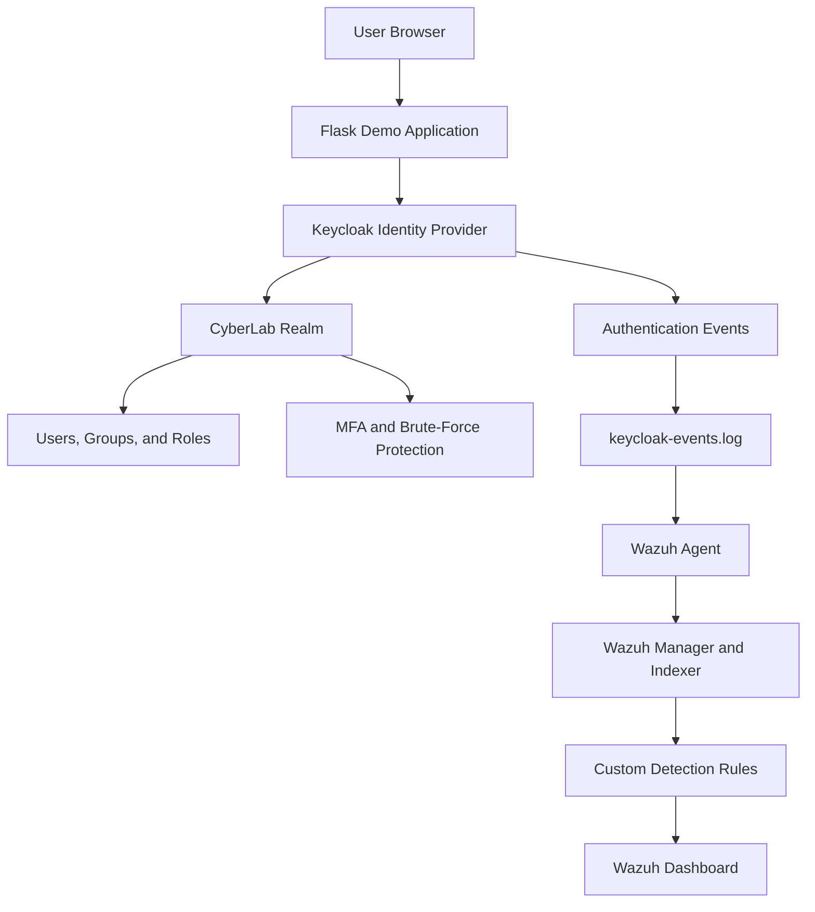
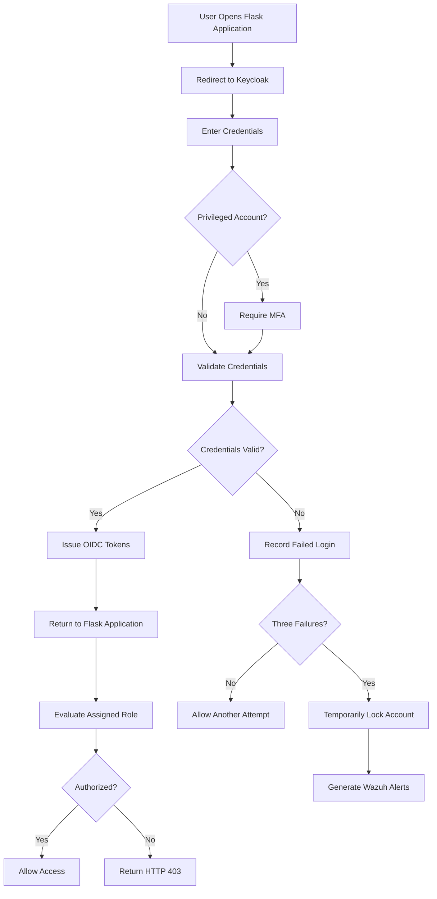
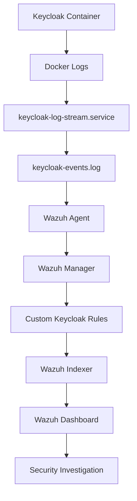

# Identity Security Architecture

## Top-Down Architecture

## Authentication Workflow

## Monitoring Workflow

## Detection Rules

- Rule 100100: Failed authentication
- Rule 100101: Successful authentication
- Rule 100102: Brute-force activity
- Rule 100103: Temporary account lockout
