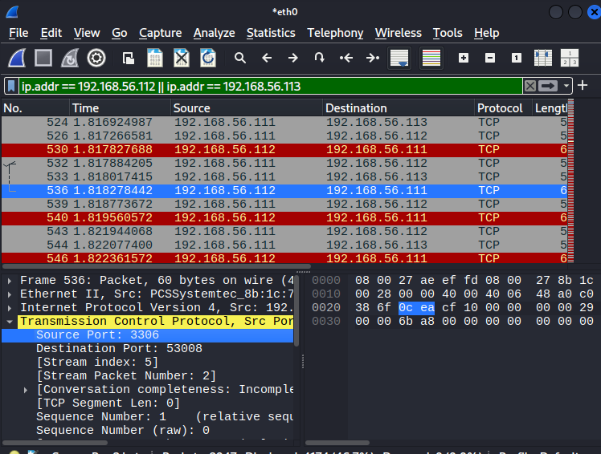
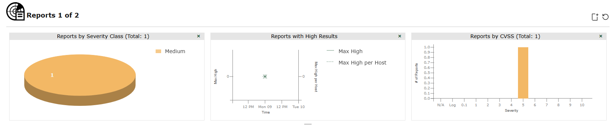
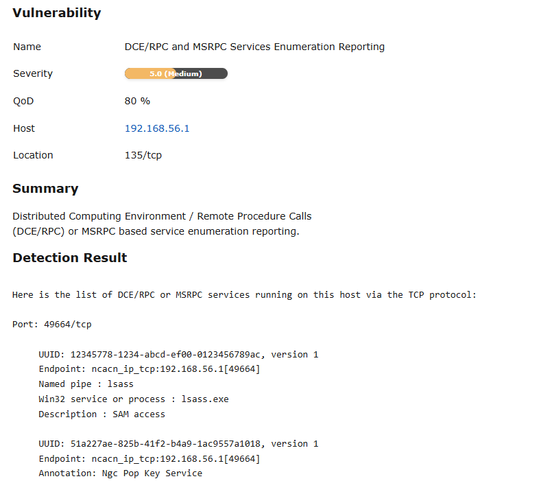

# Vulnerability Assessment Lab

A hands-on vulnerability assessment performed in a self-owned home cybersecurity lab using **Nmap**, **OpenVAS (Greenbone)**, and **Wireshark**.

## Overview

This project documents the process of identifying active hosts, enumerating exposed services, running a vulnerability scan, validating scan traffic, and producing a formal security report.

The goal of the lab was to simulate a basic security assessment workflow in a controlled virtual environment and document the results in a way that reflects real analyst work.

## Objectives

- Discover live hosts on a private lab subnet
- Enumerate exposed ports and services
- Run automated vulnerability scanning with OpenVAS
- Capture scan-related traffic with Wireshark
- Document findings and remediation recommendations

## Lab Environment

| Component | Details |
|---|---|
| Hypervisor | VirtualBox |
| Scanner | Kali Linux |
| Targets | Ubuntu VM, Windows VM |
| Network | Host-only lab subnet |
| Subnet | `192.168.56.0/24` |

## Tools Used

| Tool | Purpose |
|---|---|
| Nmap | Host discovery, port scanning, service enumeration, OS detection |
| OpenVAS / Greenbone | Vulnerability scanning and result reporting |
| Wireshark | Packet capture and scan traffic validation |
| Kali Linux | Scanner platform |
| VirtualBox | Virtual lab environment |

## Assessment Workflow

### 1. Host Discovery
Nmap was used to identify live systems on the private lab subnet.

### 2. Service Enumeration
Open ports and exposed services were identified through targeted scanning and version detection.

### 3. Vulnerability Scanning
OpenVAS was used to scan the subnet and report potential vulnerabilities and information disclosure issues.

### 4. Traffic Validation
Wireshark was used to capture and inspect scan-generated traffic between the scanner and target systems.

### 5. Reporting
Results were organized into a formal security report with findings, impact, and recommendations.

## Key Findings

The vulnerability assessment identified low- to medium-severity issues related primarily to **service exposure** and **information disclosure**.

| Finding | Severity | Notes |
|---|---|---|
| DCE/RPC and MSRPC Services Enumeration | Medium | Service enumeration possible over `135/tcp` |
| TCP Timestamps Information Disclosure | Low | Host uptime can potentially be inferred |

These findings do not indicate a critical compromise, but they do show how exposed services can provide useful reconnaissance data to an attacker.

## Evidence and Artifacts

### Report
- [Full Vulnerability Assessment Report](reports/vulnerability-assessment.md)

### Evidence Files
- [Nmap Subnet Scan Output](evidence/subnet-scan.txt)

### Screenshots
- OpenVAS scan summary  
- OpenVAS vulnerability details  
- Wireshark scan traffic capture

## Screenshots

### Wireshark Scan Traffic

### OpenVAS Scan Summary

### OpenVAS Vulnerability Details

## Repository Structure

- `README.md` — project overview
- `reports/vulnerability-assessment.md` — formal security report
- `evidence/subnet-scan.txt` — saved Nmap scan output
- `screenshots/openvas-scan-summary.png` — OpenVAS overview
- `screenshots/openvas-vulnerability-details.png` — finding details
- `screenshots/wireshark-scan-traffic.png` — captured scan traffic

## Skills Demonstrated

- Network discovery and host enumeration
- Port and service identification
- Vulnerability scanning and interpretation
- Packet capture analysis
- Security documentation and reporting

## Why This Project Matters

This lab demonstrates a practical vulnerability assessment workflow using tools commonly encountered in security operations and defensive security roles. It shows the ability to move from raw scan activity to structured findings, evidence collection, and written remediation guidance.

## Next Steps

Future improvements to this lab could include:

- rescanning after remediation to validate fixes
- expanding the target set with additional vulnerable systems
- comparing OpenVAS findings with manual validation
- adding a simple network diagram for the assessment scope